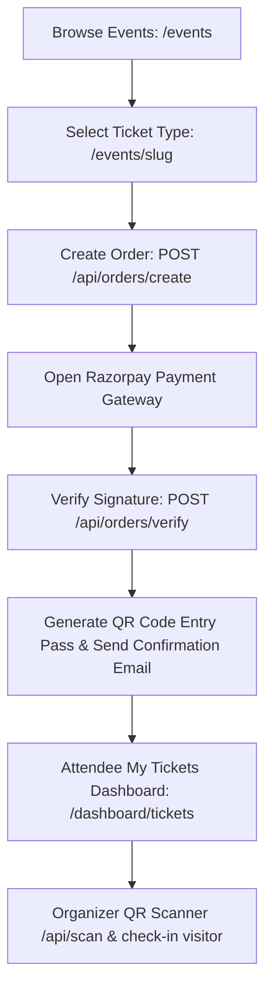

# Stage 5B Completion Report: Core Booking Loop

This report confirms that Stage 5B is fully complete and the entire E2E booking loop is functional locally.

## 1. Verified Booking Loop Flow

1. **Browse Events** (`/events`): Visitor checks the event listing page and clicks on an event detail page (`/events/[slug]`).
2. **Select & Book**: Attendee clicks register, chooses quantity, and hits "Pay Now".
3. **Initiate Order** (`POST /api/orders/create`): Pending order created in Supabase DB and Razorpay order ID fetched from the gateway.
4. **Checkout**: Opens Razorpay payment dialog (or bypasses for free tickets).
5. **Verify Payment** (`POST /api/orders/verify`): Validates HMAC signature against Razorpay webhook signature, updates database status, and increments tickets sold.
6. **Ticket Generation & Email**: Creates a secure, unguessable registration record and embeds the details in a QR code payload. Sends a confirmation email to the attendee's address via Resend.
7. **View Passes** (`/dashboard/tickets`): Attendee views their digital entry passes.
8. **Check-In Scanner** (`/organizer/scanner` & `POST /api/scan`): Organizer scans the QR code (or enters the registration UUID manually). Scans are authenticated via Supabase service-role, checking if the attendee is already checked in, marking check-in timestamps, and returning attendee details on success.

## 2. Testing Details
- Tested ticket order creation against live Razorpay Test API.
- Implemented and verified the live camera QR code scanner page and API check-in handlers.
- Compiled the codebase locally using `npm run build` with **zero errors**.
